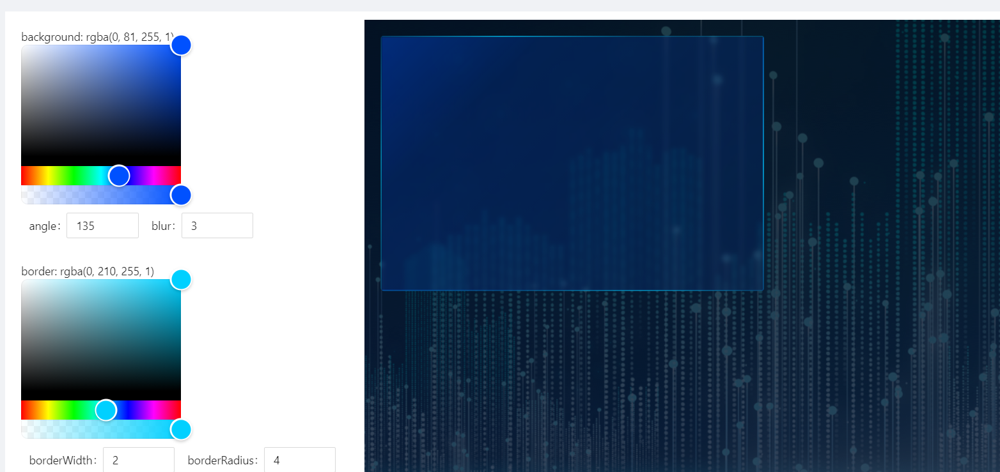

# color-gradient-converter
> Convert single-color to color-gradient

# Install
```
npm i color-gradient-converter

yarn add color-gradient-converter
```

# DEMO
* code: https://github.com/linwrui/my-react-app/blob/main/src/pages/color-gradient/index.tsx

* page: https://my-react-app-flax.vercel.app/#/color-gradient

* snapshot: 


# Usage

## Example
> you can also refer to test samples: [tests](./tests).

### ToLinearGradient
``` javascript
import { colorToLinearGradient } from "color-gradient-converter";

const linearGradient = colorToLinearGradient("red", {
    angle: 135,
    colorStopTransformTargets: [
        { opacity: 0.1 },
        { opacity: 0.6, rgbTransformValue: { g: "+25" }, markPercent: "25%" },
        { opacity: 0.1 },
    ],
});
console.log(linearGradient) // output： "linear-gradient(135deg, rgba(255, 0, 0, 0.1), rgba(255, 25, 0, 0.6) 25%, rgba(255, 0, 0, 0.1))"
```

### TransformColor
``` javascript
import { colorToLinearGradient } from "color-gradient-converter";

const color = transformColor('red', { opacity: 0.4, rgbTransformValue: { g: "+25" } })
console.log(color.formatRgb()) // output： "rgba(255, 25, 0, 0.6)"
```

## API
### ColorTransformTarget
``` typescript
/**
 * If the value is a numeric or a purely numeric character, the associated parameter uses the value as the absolute value
 *
 * If the value is a character that starts with '+' or '-', the relative value is computed with the parameters associated with the base color
 */
export type ColorTransformValue = number | string;

/**
 * Use for calc next color-stop with common color
 *
 * @export
 * @interface GradientHint
 */
export interface ColorTransformTarget {
  /**
   * By default, if there is no color with a 0% stop, the first color declared will be at that point.
   * Similarly, the last color will continue to the 100% mark,
   * or be at the 100% mark if no length has been declared on that last stop.
   *
   * @type {string} from 0%-100%
   * @memberof ColorTransformTarget
   */
  markPercent?: string;
  opacity?: ColorTransformValue;
  /**
   * Use for calc next color stop with hsl
   *
   * @type {{
   *         h?: ColorTransformValue; // from 0-360
   *         s?: ColorTransformValue; // from 0-1
   *         l?: ColorTransformValue; // from 0-1
   *     }}
   * @memberof ColorTransformTarget
   */
  hslTransformValue?: {
    h?: ColorTransformValue;
    s?: ColorTransformValue;
    l?: ColorTransformValue;
  };

  /**
   * Use for calc next color stop with rgb
   *
   * Priority lower than hslTransformValue
   * 
   * @type {{
   *         r?: ColorTransformValue; // from 0-255
   *         g?: ColorTransformValue; // from 0-255
   *         a?: ColorTransformValue; // from 0-255
   *     }}
   * @memberof ColorTransformTarget
   */
  rgbTransformValue?: {
    r?: ColorTransformValue;
    g?: ColorTransformValue;
    b?: ColorTransformValue;
  };

  /**
   * Provide a function for specified transform color;
   * 
   * Priority lower than hslTransformValue and rgbTransformValue
   */
  transformFn?: (baseColor: HSLColor, transformTarget: HSLColor) => undefined | HSLColor;
}
```

### [transformColor](./src/color-transformer.ts) Transform color with specified transform value
``` typescript
export function transformColor(baseColor: string, transformTarget: ColorTransformTarget): HSLColor
```

### [colorToLinearGradient](./src/linear-gradient-converter.ts) Convert color to linear gradient css string
``` typescript
/**
 * see https://developer.mozilla.org/en-US/docs/Web/CSS/linear-gradient()
 *
 * @export
 * @interface LinearGradientConvertOptions
 */
export interface LinearGradientConvertOptions {
  /**
   * The gradient line's angle of direction. A value of 0deg is equivalent to to top; increasing values rotate clockwise from there.
   *
   * @type {number} from 0-360
   * @memberof LinearGradientConvertOptions
   */
  angle?: number;

  /**
   * The position of the gradient line's starting point. 
   * If specified, it consists of the word to and up to two keywords: one indicates the horizontal side (left or right), and the other the vertical side (top or bottom). The order of the side keywords does not matter. 
   * If unspecified, it defaults to to bottom.
   * 
   * The values to top, to bottom, to left, and to right are equivalent to the angles 0deg, 180deg, 270deg, and 90deg, respectively. 
   * The other values are translated into an angle.
   *
   * PS: If both 'angle' and 'sideOrCorner' exist, use 'angle' preferentially
   * 
   * see https://developer.mozilla.org/en-US/docs/Web/CSS/linear-gradient()
   * 
   * @type {string}
   * @memberof LinearGradientConvertOptions
   */
  sideOrCorner?: "to top left" | "to left" | "to bottom left" | "to bottom" | "to bottom right" | "to right" | "to top right" | "to top";

  /**
   * use for calc color stops
   *
   * @type {ColorTransformTargets}
   * @memberof LinearGradientConvertOptions
   */
  colorStopTransformTargets: ColorTransformTargets;
}

/**
 * convert color to linearGradient
 *
 * @export
 * @param {string} baseColor
 * @param {LinearGradientConvertOptions} convertOptions
 * @returns
 */
export function colorToLinearGradient( baseColor: string, convertOptions: LinearGradientConvertOptions)
```